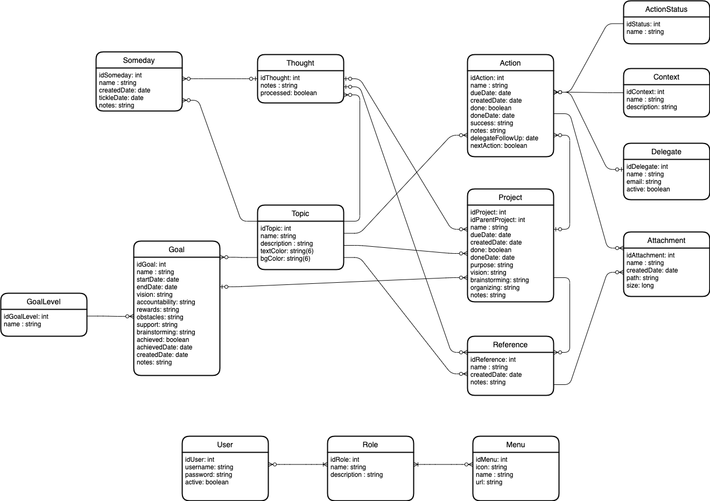

<h1 align="center">Proyecto Final Escalab Spring</h1>

<i>Realizado en Spring + Angular, inspirado en la plataforma de tareas <a href="https://www.trgtd.com.au">Thinking Rock</a>.</i>

 

# Work in Progress
Aun falta por agregar información acá. Por lo pronto sólo se encuentra el modelo del proyecto en formato Draw.io acá

