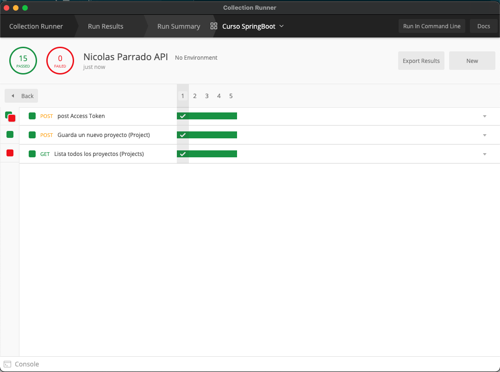

<h1 align="center">Proyecto Final Escalab Spring</h1>
<p align="center"><i>Realizado en Spring, inspirado en la plataforma de tareas <a href="https://www.trgtd.com.au">Thinking Rock</a>.</i></p>
<div align="center">


</div>
<br>


# Thinking Rock - ¿Qué es?

<a href="https://www.trgtd.com.au">Thinking Rock</a> es una poderosa herramienta de gestión de proyectos diseñada para maximizar su productividad. Está inspirada fuertemente por la metodología GTD® (<a href="https://gettingthingsdone.com"> Getting Things Done</a>) creada por David Allen, y que en una serie de pasos ayuda a tener un mayor control de las tareas diarias y planificadas.


# Entregables exigidos
## Modelo de Datos

Se incluye el Modelo de datos en formato PNG y DrawIO. Se puede notar que el corazón del sistema son los Objetivos (Goals), Proyectos (Projetcs) y Acciones (Actions).


## Pruebas de Estrés

Se realizó una prueba de estrés con Postman Runner, en donde se validó tanto la obtención de token, el guardado de un proyecto nuevo, y el listado de todos los proyectos. 

Se realizó un total de 5 pruebas, incorporando el Test necesario para validar el resultado. Se muestra la imagen de la prueba de estrés a continuación:



## Servicio Backend Spring

El servicio backend fue creado con las siguientes librerías (entre otras):

- Spring Boot 2.4.0
- Java 1.8
- Spring Security OAuth 2.3.5.RELEASE
- Lombok
- Spring Doc Open Api 1.5.2

Todas las APIs tienen el nivel más alto de Web Services revisados en clases, **HATEOAS**. Se trató de agregar links válidos y necesarios a cada uno de los controladores.

Al inciar el servicio se crea inmediatamente un usuario básico con los siguientes datos:

- **Username**: `nparrado`
- **Password**: `123`
- **Rol**: `admin`

De esta forma, se puede usar la seguridad por Token sin problemas, con los siguients datos de Autorización:

- **Username**: `proyecto_propio_id`
- **Password**: `Yv!zN2!FdGK#JQjJ`


## Documentación con Swagger

Se usó **Open Api** en vez de **Springfox** porque planeo utilizar todo lo aprendido por con Java 11 en adelante. La URL de Swagger es la siguiente: [http://localhost:8080/swagger-ui.html](http://localhost:8080/swagger-ui.html).


# Adicionales

## Docker

Se incluye en la raiz del proyecto un documento Docker-Compose y Dockerfile para poder levantar el sistema en un solo comando:

``` bash
docker-compose up -d
```

De esta forma se puede realizar toda la instalación del proyecto sin necesidad de tener las librerías, versiones de java, ni nada salvo por Docker operando correctamente.

**NOTA**: Al iniciar la BD despues del servicio, puede que hayan algunos errores de Hibernate, pero estos se solucionan una vez termina de levantar la base de datos.

## Colección de Postman

Se incluye la colección de Postman utilizada para las pruebas, en donde se incluyen los tests para guardar la variable global llamada access_token con el token de acceso, y se incluyen ejemplos para crear un Proyecto y una Acción.

El archivo está en la ruta: [documentacion/Nicolas\_Parrado\_API.postman\_collection.json](documentacion/Nicolas_Parrado_API.postman_collection.json)
